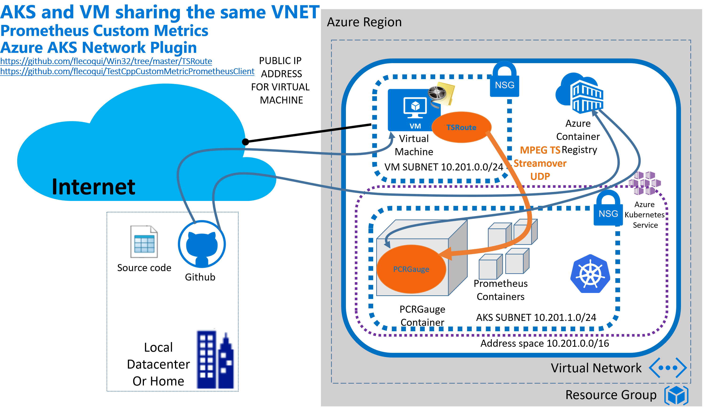
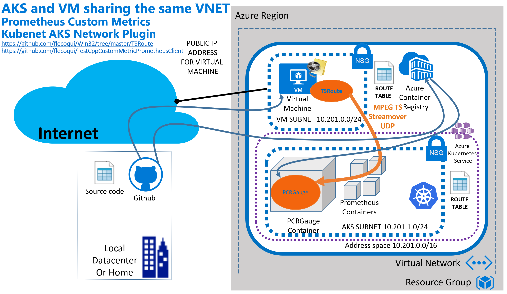

# AKS Cluster and Virtual Machine sharing the same VNET

This ARM template demonstrates the deployment of an AKS instance with advanced networking features to associate a Virtual Machine with the AKS Cluster.

Below the architecture when the solution is deployed using Azure AKS network plugin:

Below the architecture when the solution is deployed using Kubenet AKS network plugin:

You'll find further information about the usage of this ARM Template [here](https://github.com/flecoqui/TestCppCustomMetricPrometheusClient).

`Tags: AKS, Kubernetes, Advanced Networking`

## Create the resource group

1. Open a command shell window on your machine and navigate to the folder containing your local git repository  

            C:\git\me>   

2. Clone the current repository on your machine   

            C:\git\me> git clone https://github.com/flecoqui/TestCppCustomMetricPrometheusClient.git    

3. Change directory to the ARM template folder   

            C:\git\me\TestCppCustomMetricPrometheusClient\101-aks-vnet-vm> 

4. With the following Azure CLI command create the resource group for the Azure Kubernetes Cluster:

**Azure CLI 2.0:** az group create -n "ResourceGroupName" -l "Location"

     For instance:

            C:\git\me\TestCppCustomMetricPrometheusClient\101-aks-vnet-vm> az group create -n aksvnetvmrg -l eastus2

## Deploy the AKS Cluster and Virtual Machine

1. Edit the file azuredeploy.parameters.json to define the parameters required to create the virtual machine which will stream a MPEG2-TS Stream and the AKS Cluster. 

Below the information related to those parameters:

| Attribute name | value type | default value | Description | 
| :--- | :--- | :--- |  :--- | 
|vmAdminUsername| string | null | Virtual Machine Login Name |
|vmAdminPassword| securestring | null | Virtual Machine Login Password |
|vmDnsLabelPrefix| string | winaksvm | Unique DNS Name for the Public IP used to access the Virtual Machine dnsLabelPrefix.Region.cloudapp.azure.com |
|vmSize| string | Standard_D1_v2 | VM Size |
|vmOsVersion| string | 2016-Datacenter | OS Version - Image SKU |
|vmInitscriptUrl| string | https://raw.githubusercontent.com/flecoqui/TestCppCustomMetricPrometheusClient/master/101-aks-vnet-vm/install-tsroute.ps1 | The url to the installation script |
|vmInitScriptFileName| string | install-tsroute.ps1 | The Name of the installation script |
|aksResourceName| string | null | The name of the Managed Cluster resource |
|aksDnsPrefix| string | null| Optional DNS prefix to use with hosted Kubernetes API server FQDN. |
|aksOsDiskSizeGB| int | 0 | Disk size (in GB) to provision for each of the agent pool nodes. This value ranges from 0 to 1023. Specifying 0 will apply the default disk size for that agentVMSize. |
|aksAgentCount| int | 3 | The number of agent nodes for the cluster. Production workloads have a recommended minimum of 3. |
|aksAgentVMSize| string | Standard_D2_v2 | The size of the AKS Virtual Machines. |
|aksServicePrincipalClientId| securestring | null | Client ID or App ID (used by cloudprovider) |
|aksServicePrincipalClientSecret| securestring | null | The Service Principal Client Secret. |
|aksKubernetesVersion| string | 1.10.12 | The version of Kubernetes. |
|aksNetworkPlugin| string | azure | Network plugin used for building Kubernetes network: azure or kubenet |
|aksMaxPods| int | 30 | Maximum number of pods that can run on a node. |
|aksEnableRBAC| bool | true | boolean flag to turn on and off of RBAC |

2. Once the parameter file is ready, with the following Azure CLI command you'll deploy the virtual machine and the AKS Cluster on your resource group :

**Azure CLI 2.0:** az group deployment create -g "ResourceGroupName" -n "DeploymentName" --template-file azuredeploy.json --parameter @azuredeploy.parameters.json --verbose -o json

     For instance:

            C:\git\me\TestCppCustomMetricPrometheusClient\101-aks-vnet-vm> az group deployment create -g aksvnetvmrg -n aksvnetvmtest --template-file azuredeploy.json --parameter @azuredeploy.parameters.json --verbose -o json

## Delete the Resource Group

If after your tests, you want to remove the AKS Cluster and the Virtual Machine from your Azure Subscription run the following command:

**Azure CLI 2.0:** az group delete -n "ResourceGroupName"

     For instance:

            az group delete -n aksvnetvmrg

