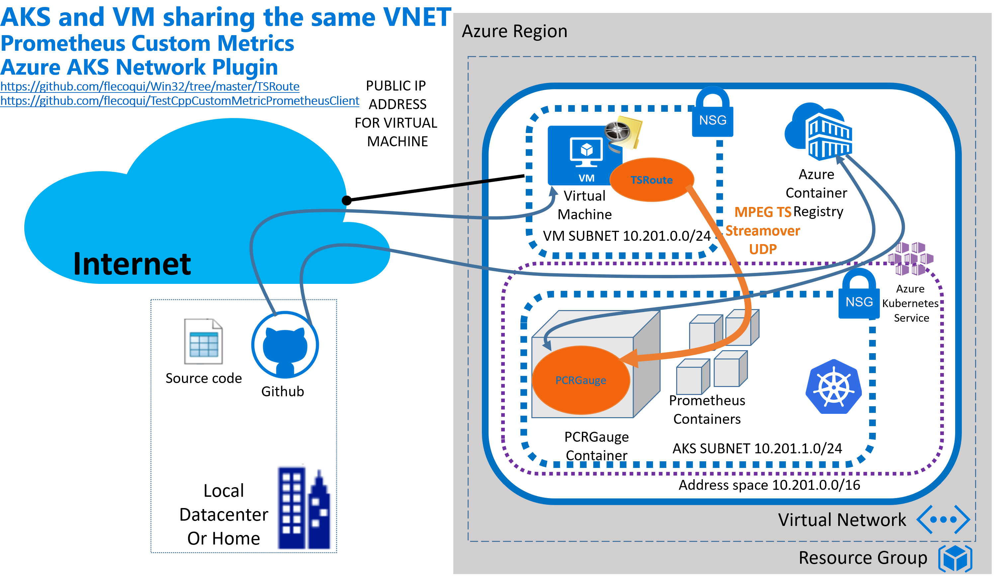
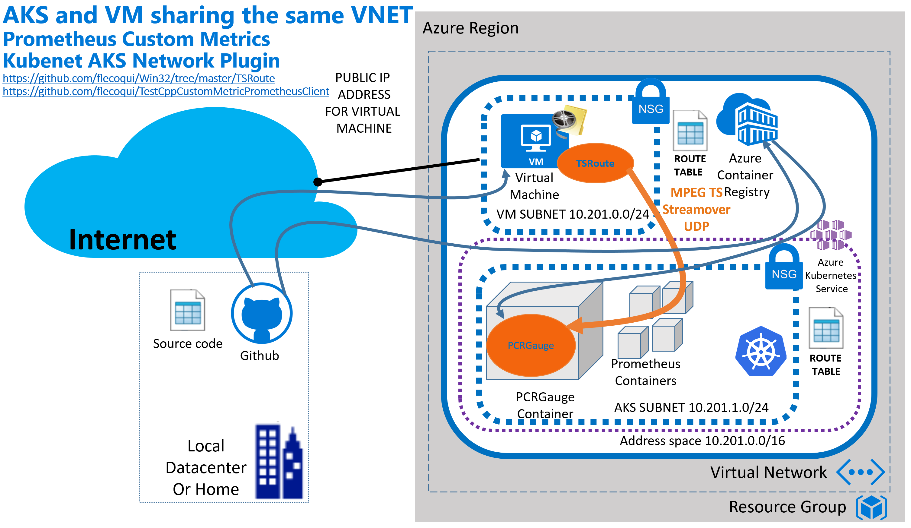
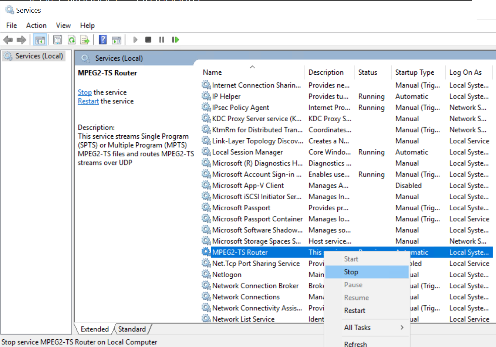
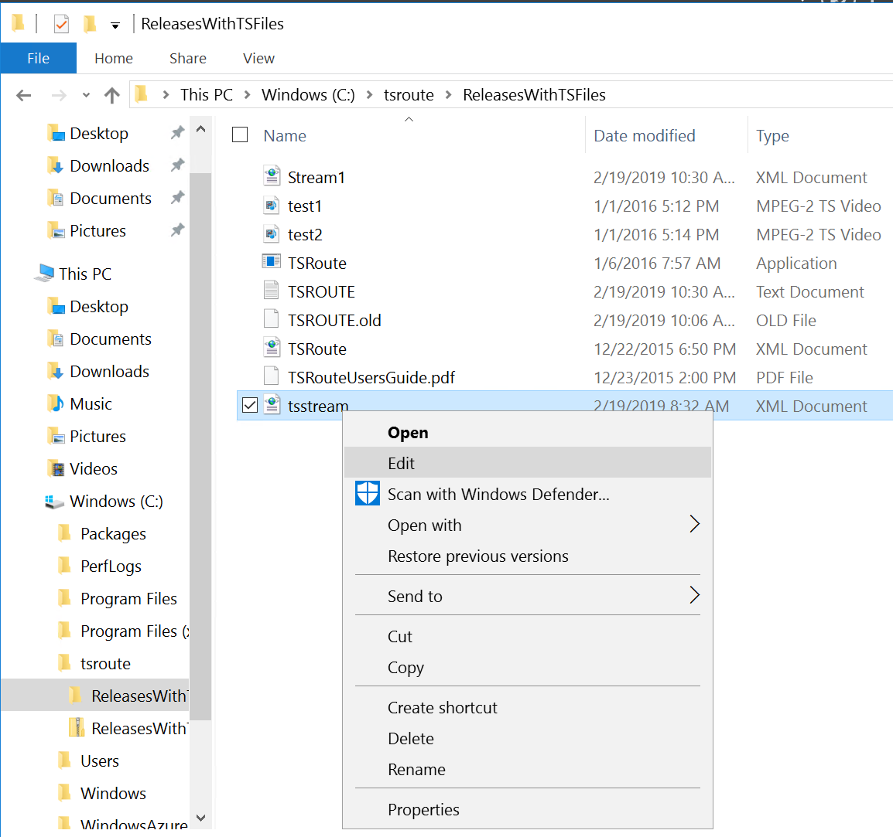
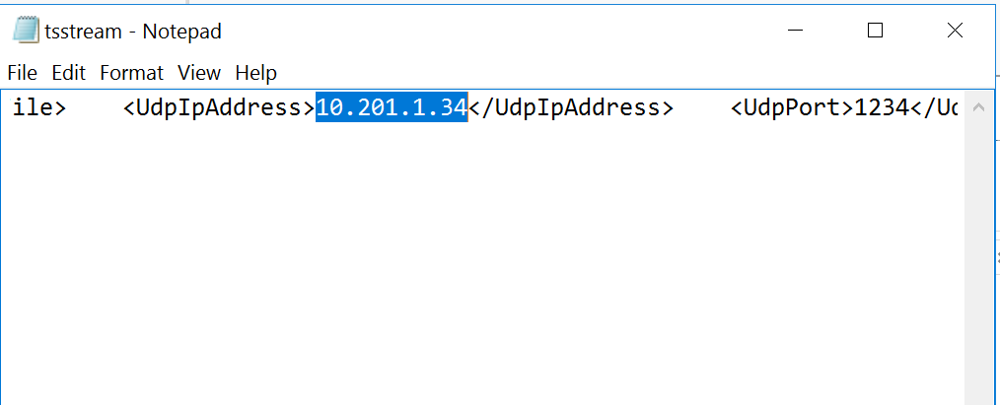
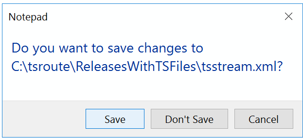
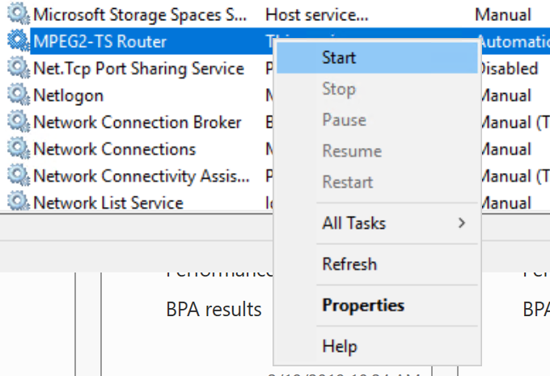
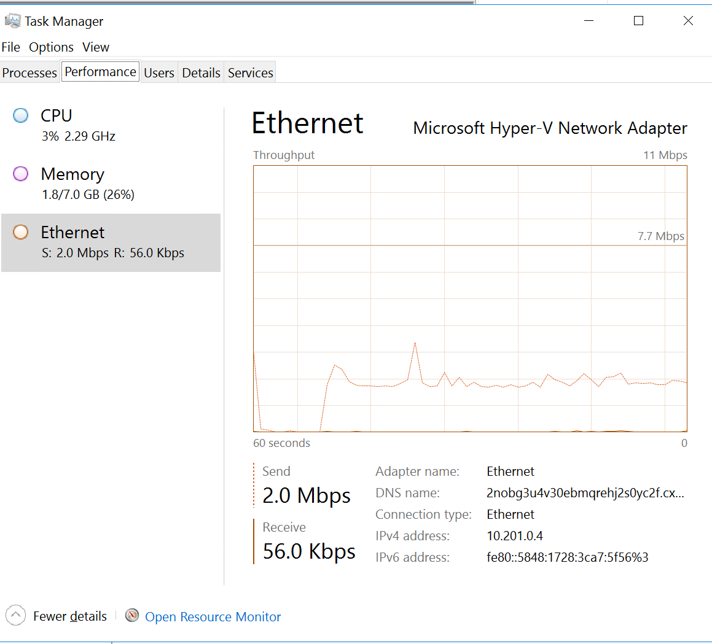

# Custom Prometheus Metrics PCR Gauge
This github repository contains:
- [A Sample application](https://github.com/flecoqui/TestCppCustomMetricPrometheusClient/tree/master/PCRGauge) which implements a  PCR Gauge based on a Custom Prometheus Metric running in Container in Azure Kubernetes Service;
- [An ARM Template](https://github.com/flecoqui/TestCppCustomMetricPrometheusClient/tree/master/101-aks-vnet-vm) to deploy in the same Azure Resource Group a Virtual Machine used to stream the MPEG2-TS Stream and an AKS Cluster running the prometeus components and the PCR Gauge container which will consume the MPEG2-TS stream to extract the PCR.

Below the architecture when the solution is deployed using Azure AKS network plugin:

Below the architecture when the solution is deployed using Kubenet AKS network plugin:

Below the different steps to deploy this solution.

## Getting the Azure Subscription 
First you need an Azure subscription.
You can subscribe here:  https://azure.microsoft.com/en-us/free/ . 

## Installing Azure CLI v2 on Windows
Moreover, we will use Azure CLI v2.0 to deploy the resources in Azure.
You can install Azure CLI on your machine running Linux, MacOS or Windows from here: https://docs.microsoft.com/en-us/cli/azure/install-azure-cli?view=azure-cli-latest 

Once, Azure CLI v2 is installed on your machine, you can check the version of Azure CLI installed

1. Open a command shell window on your machine  

            C:\users\me>  

2. Launch the following command to get the current version of Azure CLI:

            C:\users\me> az --version 

## Installing Kubectl on Windows
Now as Azure CLI is installed, you can install Kubernetes Command Line Client Kubectl on your machine.
Use the following Azure CLI command to install the Kubernetes Command Line Client:
**Azure CLI 2.0:** az aks install-cli 

1. Run the following command:  

        C:\users\me>  az aks install-cli

2. Launch the following command to get the current version of kubectl on your machine:

        C:\users\me>  kubectl version 

## Installing Helm on Windows 
In order to deploy Prometheus and Grafana on your AKS (Azure Kubernetes Service) cluster, you need to install HELM on your machine.

1. Download this version of Helm for Windows:
https://storage.googleapis.com/kubernetes-helm/helm-v2.12.2-windows-amd64.zip
2. Unzip the zip file, you should see the two files helm.exe and tiller.exe on the hard drive of your machine.
3. Go to Control Panel --> System.
4. Click Advanced system settings.
5. Select Advanced tab and click Environment Variables.
6. In the System Variables area, locate the Path variable, highlight it and click Edit...
7. Click New, and add the path of the folder which contains helm.exe and tiller.exe
8. Click OK , OK , OK.

## Deploying the solution on an AKS Cluster 
In order to deploy the solution on a new AKS (Azure Container Service) Cluster, you'll need to: 
 
1. Create an Azure Container Registry
2. Create an Azure Kubernetes Cluster

The Azure Container Registry will be used to host the image of the PCR Gauge based on a Custom Prometheus Metric.
If you are interested, you can get further information about Azure Kubernetes Service here: https://docs.microsoft.com/fr-fr/azure/aks/kubernetes-walkthrough .

You can check the sample application here: https://github.com/Azure-Samples/azure-voting-app-redis

### Creating an Azure Container Registry
Before deploying your containers in Azure you need to create an Azure Container Registry where you'll store the images associated with your containers.

1. Open a command shell window  

        C:\users\me> 

2. Create a resource group with Azure CLI using the following command:

**Azure CLI 2.0:** az group create --resource-group "ResourceGroupName" --location "RegionName"

For instance:

        C:\users\me> az group create --resource-group acrrg --location eastus2

3. Create an Azure Container Registry with Azure CLI using the following command:

**Azure CLI 2.0:** az acr create --resource-group "ResourceGroupName" --name "ACRName" --sku "ACRSku" --location "RegionName"

For instance:

        C:\users\me> az acr create --resource-group acrrg --name acreu2  --sku Standard --location eastus2  

Your Azure Container Registry is now deployed.

### Creating the AKS Cluster
Now, your Azure Container Registry is installed, you can deploy your AKS cluster.

You'll find further information here:

https://docs.microsoft.com/fr-fr/azure/aks/tutorial-kubernetes-deploy-cluster 

#### CREATING SERVICE PRINCIPAL FOR AKS DEPLOYMENT

1. With Azure CLI create an Service Principal:
**Azure CLI 2.0:** az ad sp create-for-rbac --skip-assignment 

For instance:

          C:\users\me> az ad sp create-for-rbac --skip-assignment
 
      The command returns the following information associated with the new Service Principal:
      - appID
      - displayName
      - name
      - password
      - tenant

     For instance:

          AppId                                 Password                            
          ------------------------------------  ------------------------------------
          d604dc61-d8c0-41e2-803e-443415a62825  097df367-7472-4c23-96e1-9722e1d8270a

2. Display the ID associated with the new Azure Container Registry using the following command:

In order to allow the Service Principal to have access to the Azure Container Registry you need to display the ACR resource ID with the following command:

**Azure CLI 2.0:** az acr show --name "ACRName" --query id --output tsv

For instance:

        C:\users\me> az acr show --name acreu2 --query id --output tsv

     The command returns ACR resource ID.

     For instance:

        /subscriptions/e5c9fc83-fbd0-4368-9cb6-1b5823479b6d/resourceGroups/acrrg/providers/Microsoft.ContainerRegistry/registries/acreu2

3. Allow the Service Principal to have access to the Azure Container Registry with the following command:

**Azure CLI 2.0:** az role assignment create --assignee "AppID" --scope "ACRReourceID" --role Reader
 For instance:

        C:\users\me> az role assignment create --assignee d604dc61-d8c0-41e2-803e-443415a62825 --scope /subscriptions/e5c9fc83-fbd0-4368-9cb6-1b5823479b6d/resourceGroups/acrrg/providers/Microsoft.ContainerRegistry/registries/acreu2 --role Reader

#### CREATING THE KUBERNETES CLUSTER
Now you can create the Kubernetes Cluster in Azure. 

##### CREATING THE KUBERNETES CLUSTER WITH THE VIRTUAL MACHINE TO STREAM CONTENT TOWARDS THE CLUSTER

1. Open a command shell window on your machine and navigate to the folder containing your local git repository  

            C:\git\me>   

2. Clone the current repository on your machine   

            C:\git\me> git clone https://github.com/flecoqui/TestCppCustomMetricPrometheusClient.git    

3. Change directory to the ARM template folder   

            C:\git\me\TestCppCustomMetricPrometheusClient\101-aks-vnet-vm> 

4. With the following Azure CLI command create the resource group for the Azure Kubernetes Cluster:

**Azure CLI 2.0:** az group create -n "ResourceGroupName" -l "Location"

     For instance:

            C:\git\me\TestCppCustomMetricPrometheusClient\101-aks-vnet-vm> az group create -n aksvnetvmrg -l eastus2

5. Edit the file azuredeploy.parameters.json to define the parameters required to create the virtual machine which will stream a MPEG2-TS Stream and the AKS Cluster. 

Below the information related to those parameters:

| Attribute name | value type | default value | Description | 
| :--- | :--- | :--- |  :--- | 
|vmAdminUsername| string | null | Virtual Machine Login Name |
|vmAdminPassword| securestring | null | Virtual Machine Login Password |
|vmDnsLabelPrefix| string | winaksvm | Unique DNS Name for the Public IP used to access the Virtual Machine dnsLabelPrefix.Region.cloudapp.azure.com |
|vmSize| string | Standard_D1_v2 | VM Size |
|vmOsVersion| string | 2016-Datacenter | OS Version - Image SKU |
|vmInitscriptUrl| string | https://raw.githubusercontent.com/flecoqui/TestCppCustomMetricPrometheusClient/master/101-aks-vnet-vm/install-tsroute.ps1 | The url to the installation script |
|vmInitScriptFileName| string | install-tsroute.ps1 | The Name of the installation script |
|aksResourceName| string | null | The name of the Managed Cluster resource |
|aksDnsPrefix| string | null| Optional DNS prefix to use with hosted Kubernetes API server FQDN. |
|aksOsDiskSizeGB| int | 0 | Disk size (in GB) to provision for each of the agent pool nodes. This value ranges from 0 to 1023. Specifying 0 will apply the default disk size for that agentVMSize. |
|aksAgentCount| int | 3 | The number of agent nodes for the cluster. Production workloads have a recommended minimum of 3. |
|aksAgentVMSize| string | Standard_D2_v2 | The size of the AKS Virtual Machines. |
|aksServicePrincipalClientId| securestring | null | Client ID or App ID (used by cloudprovider) |
|aksServicePrincipalClientSecret| securestring | null | The Service Principal Client Secret. |
|aksKubernetesVersion| string | 1.10.12 | The version of Kubernetes. |
|aksNetworkPlugin| string | azure | Network plugin used for building Kubernetes network: azure or kubenet |
|aksMaxPods| int | 30 | Maximum number of pods that can run on a node. |
|aksEnableRBAC| bool | true | boolean flag to turn on and off of RBAC |

6. Once the parameter file is ready, with the following Azure CLI command you'll deploy the virtual machine and the AKS Cluster on your resource group :

**Azure CLI 2.0:** az group deployment create -g "ResourceGroupName" -n "DeploymentName" --template-file azuredeploy.json --parameter @azuredeploy.parameters.json --verbose -o json

     For instance:

            C:\git\me\TestCppCustomMetricPrometheusClient\101-aks-vnet-vm> az group deployment create -g aksvnetvmrg -n aksvnetvmtest --template-file azuredeploy.json --parameter @azuredeploy.parameters.json --verbose -o json

7. Connect the Kubernetes Command Line Client to your Cluster in Azure using the following Azure CLI command:
**Azure CLI 2.0:** az aks get-credentials --resource-group "ResourceGroupName" --name "AKSClusterName" --overwrite-existing

     For instance:

        az aks get-credentials --resource-group aksvnetvmrg --name akstest --overwrite-existing

8. Check the connection from the Kubernetes Command Line Client with the following command:
**kubectl:** kubectl get nodes

     The commmand will return information about the Kuberentes nodes.
     For instance:

        NAME                       STATUS    ROLES     AGE       VERSION
        aks-nodepool1-38201324-0   Ready     agent     16m       v1.10.12

     You are now connected to your cluster from your local machine.

Note:

If after your tests, you want to remove the AKS Cluster and the Virtual Machine from your Azure Subscription run the following command:

**Azure CLI 2.0:** az group delete -n "ResourceGroupName"

     For instance:

            az group delete -n aksvnetvmrg

##### CREATING ONLY THE KUBERNETES CLUSTER WITHOUT VIRTUAL MACHINE TO STREAM CONTENT TOWARDS THE CLUSTER

1. With the following Azure CLI command create the Azure Kubernetes Cluster:

**Azure CLI 2.0:** az aks create --resource-group "ResourceGroupName" --name "AKSClusterName" --node-count 1 --service-principal "SPAppID" --client-secret "SPPassword" --generate-ssh-keys 

     For instance:

        az aks create --resource-group acrrg --name netcoreakscluster --node-count 1 --service-principal d604dc61-d8c0-41e2-803e-443415a62825   --client-secret 097df367-7472-4c23-96e1-9722e1d8270a --generate-ssh-keys

2. Connect the Kubernetes Command Line Client to your Cluster in Azure using the following Azure CLI command:
**Azure CLI 2.0:** az aks get-credentials --resource-group "ResourceGroupName" --name "AKSClusterName" 

     For instance:

        az aks get-credentials --resource-group acrrg --name netcoreakscluster --overwrite-existing

3. Check the connection from the Kubernetes Command Line Client with the following command:
**kubectl:** kubectl get nodes

     The commmand will return information about the Kuberentes nodes.
     For instance:

        NAME                       STATUS    ROLES     AGE       VERSION
        aks-nodepool1-38201324-0   Ready     agent     16m       v1.10.12

     You are now connected to your cluster from your local machine.

## Deploying Prometeus on the AKS Cluster 
Your AKS Cluster is now deployed, you can deploy the Prometheus component on this cluster using HELM.

1. With the following kubectl command line, you'll create the tiller service account:

            kubectl -n kube-system create serviceaccount tiller

2. With the following kubectl command line, you'll create a cluster role associated with tiller:

            kubectl create clusterrolebinding tiller --clusterrole cluster-admin --serviceaccount=kube-system:tiller

3. With the following helm command line, you'll initialize helm on your cluster:

            helm init --service-account tiller

4. With the following helm command line, you'll deploy the prometheus components on your cluster in the namespace "monitoring" for release prometheus-operator:

            helm install stable/prometheus-operator  --name=prometheus-operator --namespace=monitoring

5. With the following helm command line, you'll set value prometheus.prometheusSpec.serviceMonitorSelectorNilUsesHelmValues to false to allow the prometheus component to discover custom metric components like PCR Gauge:

            helm upgrade prometheus-operator stable/prometheus-operator --set prometheus.prometheusSpec.serviceMonitorSelectorNilUsesHelmValues=false

5. With the following helm command line, you'll check if the new value is taken into account:

            helm get values prometheus-operator

Note:
You can remove the prometheus components from your cluster using the following commands:

            helm delete --purge prometheus-operator

            kubectl delete crd alertmanagers.monitoring.coreos.com prometheuses.monitoring.coreos.com prometheusrules.monitoring.coreos.com servicemonitors.monitoring.coreos.com

## Using the Application
Your infrastructure is now ready, the virtual machine and the AKS Cluster. You can now build and deploy the PCR Gauge image on your servers.

Below the information related to the usage of PCR Gauge

PCR Gauge Custom Prometheus Client:
Syntax:
PCRGauge --prometheusport <local TCP port used to receive Prometheus request>
         --tsport <local UDP port used to receive the TS stream>
        [--verbose] 

For instance:
Launch PCRGauge to receive the http request on port 8080 and receiving the TS Stream on multicast address 239.0.0.1 and UDP port 1234:

        PCRGauge --prometheusport 8080 --tsport 239.0.0.1:1234 

Launch PCRGauge to receive the http request on port 8080 and receiving the TS Stream on unicast address 127.0.0.1 and UDP port 1234, and receiving the TS Stream on multicast adress 239.0.0.1:2501

        PCRGauge --prometheusport 8080 --tsport 127.0.0.1:1234,239.0.0.1:2501 

## Building the container image with Azure CLI

1. Change directory to the PCR Gauge folder   

            C:\git\me\TestCppCustomMetricPrometheusClient\PCRGauge> 

2. Run the following Azure CLI command to build the image:

            C:\git\me\TestCppCustomMetricPrometheusClient\PCRGauge> az acr build --registry "ACRName"   --image pcrgauge:v1 .

The image is built using the DockerFile below:

            # Get the GCC preinstalled image from Docker Hub
            FROM gcc:8

            RUN apt-get update && apt-get install -y curl git
            RUN apt-get install libcurl4-openssl-dev
            RUN apt-get install zlib1g-dev

            #  install cmake
            RUN curl https://cmake.org/files/v3.13/cmake-3.13.2-Linux-x86_64.sh -o /tmp/curl-install.sh \
                && chmod u+x /tmp/curl-install.sh \
                && mkdir /usr/bin/cmake \
                && /tmp/curl-install.sh --skip-license --prefix=/usr/bin/cmake \
                && rm /tmp/curl-install.sh

            ENV PATH="/usr/bin/cmake/bin:${PATH}"

            # install library 
            WORKDIR /usr/src
            RUN git clone https://github.com/jupp0r/prometheus-cpp.git

            WORKDIR /usr/src/prometheus-cpp

            RUN git submodule init
            RUN git submodule update

            RUN mkdir /usr/src/prometheus-cpp/3rdparty/civetweb/_build
            WORKDIR /usr/src/prometheus-cpp/3rdparty/civetweb/_build
            RUN cmake ..  -DCIVETWEB_ENABLE_CXX=ON -DCIVETWEB_ENABLE_SSL=OFF -DCIVETWEB_BUILD_TESTING=OFF
            RUN make -j 4 
            RUN make install

            RUN mkdir /usr/src/prometheus-cpp/3rdparty/googletest/_build
            WORKDIR /usr/src/prometheus-cpp/3rdparty/googletest/_build
            RUN cmake ..  
            RUN make -j 4 
            RUN make install

            RUN mkdir /usr/src/prometheus-cpp/_build
            WORKDIR /usr/src/prometheus-cpp/_build
            RUN cmake ..  -DBUILD_SHARED_LIB=ON
            RUN make -j 4 
            RUN make DESTDIR=/ install

            # Copy the current folder which contains C++ source code to the Docker image under /usr/src
            COPY . /usr/src/dockertest1

            # Specify the working directory
            WORKDIR /usr/src/dockertest1

            # Use GCC to compile the Test.cpp source file
            RUN g++ -o PCRGauge PCRGauge.cpp -std=c++11 -lz -I/usr/local/include/  /usr/local/lib/libprometheus-cpp-pull.a /usr/local/lib/libprometheus-cpp-core.a /usr/local/lib/libprometheus-cpp-push.a /usr/local/lib/libcivetweb.a  /usr/local/lib/libcivetweb-cpp.a  /usr/local/lib/libgmock.a  /usr/local/lib/libgmock_main.a  /usr/local/lib/libgtest.a  /usr/local/lib/libgtest_main.a -pthread

            ENV LISTENING_PORT 8080
            # Run the program output from the previous step
            CMD ["./PCRGauge"]

## Deploying the container image  with Kubectl
Now the PCRGauge image is avaiable on your Azure Container Registry. You can deploy this image on your AKS Cluster.

1. Use the following kubectl command line to deploy the PCRGauge image on your AKS Cluster inthe monitoring namespace.

            C:\git\me\TestCppCustomMetricPrometheusClient\PCRGauge> kubectl apply -f pcrgauge.aks.yaml -n monitoring

The yaml file used to deploy the solution on AKS:

            apiVersion: v1
            kind: Service
            metadata:
            name: pcrgauge
            labels:
                app: pcrgauge
            spec:
            ports:
            - name: http
                port: 8080
                targetPort: http
            - name: ts
                protocol: UDP
                port: 1234
                targetPort: 1234
            selector:
                app: pcrgauge
            ---
            apiVersion: apps/v1
            kind: Deployment
            metadata:
            name: pcrgauge
            labels:
                app: pcrgauge
            spec:
            replicas: 1
            selector:
                matchLabels:
                app: pcrgauge
            template:
                metadata:
                labels:
                    app: pcrgauge
                spec:
                containers:
                - name: pcrgauge
                    image: testacreu2.azurecr.io/pcrgauge:v1
                    command: ["./PCRGauge","--prometheusport", "8080", "--tsport", "127.0.0.1:1234" ]
                    imagePullPolicy: IfNotPresent
                    ports:
                    - containerPort: 8080
                        name: http       
                    - containerPort: 1234
                        name: ts                 
                    env:
                    - name: LISTENING_PORT
                        value: "8080"
            ---
            apiVersion: monitoring.coreos.com/v1
            kind: ServiceMonitor
            metadata:
            name: pcrgauge
            labels:
                app: pcrgauge
            spec:
            selector:
                matchLabels:
                app: pcrgauge
            endpoints:
            - port: http

## Checking the deployment of the container image

### Checking if the pod is deployed with kubectl

Use the following kubectl command line to check if the PCRGauge container is running :

            kubectl get pods -n monitoring -o wide

You should see pcrgauge in the list of pods running:  

        NAME                                                      READY     STATUS    RESTARTS   AGE       IP            NODE
        alertmanager-prometheus-operator-alertmanager-0           2/2       Running   0          1h        10.244.1.13   aks-agentpool-32014029-0
        pcrgauge-c58fdc84b-2jgph                                  1/1       Running   0          4m        10.244.1.34   aks-agentpool-32014029-0
        prometheus-operator-grafana-7869d7b74-dbcpp               3/3       Running   0          1h        10.244.1.12   aks-agentpool-32014029-0
        prometheus-operator-kube-state-metrics-5fc876d8f6-wfwfz   1/1       Running   0          1h        10.244.1.10   aks-agentpool-32014029-0
        prometheus-operator-operator-69d6cd685f-c6gwp             1/1       Running   0          1h        10.244.1.11   aks-agentpool-32014029-0
        prometheus-operator-prometheus-node-exporter-k6pw6        1/1       Running   0          1h        10.201.1.4    aks-agentpool-32014029-0
        prometheus-prometheus-operator-prometheus-0               3/3       Running   1          1h        10.244.1.14   aks-agentpool-32014029-0

With this kubectl command line, you can get the IP address of the PCRGauge pod. 

### Updating TSRoute configuration on the virtual machine to stream the MPEG2-TS stream towards the ip address associated with the PCR Gauge pod

1. Open an RDP session with the Virtual Machine running in the same resource group. By default this Windows Virtual Machine has been installed in TSRoute which will be used to stream a MPEG2-TS stream towards the ip address associated with the PCR Gauge.

2. Run services.msc to display the list of services running in the virtual machine

3. Stop the service MPEG2-TS Router

4. Open the file tsstream.xml under  C:\tsroute\ReleasesWithTSFiles the service MPEG2-TS Router

5. Edit the file tsstream.xml and update the field UdpIpAddress with the IP address of your PCR Gauge container.

6. Save the file tsstream.xml .

6. Start the service MPEG2-TS Router

7. Start the service MPEG2-TS Router

8. with Task Manager (taskmgr.exe) check that there is a network activity around 2 Mb/s

### Checking if the Custom Metric is visible with kubectl
Now your PCRGauge should receive the MPEG2-TS stream and retrieve the PCR Time stamps. 
We 
 
Use the following command:

    kubectl port-forward -n monitoring prometheus-prometheus-operator-prometheus-0 9090

### Checking the counter values with kubectl

Use the following command:

    kubectl exec pcrgauge-c58fdc84b-p49b4 -n monitoring -- curl http://127.0.0.1:8080/metrics

